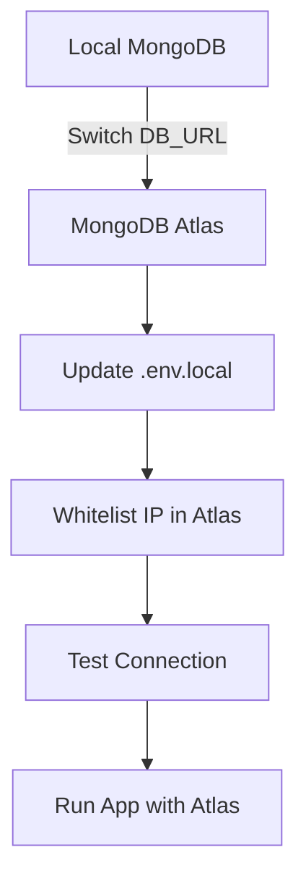

# MongoDB Atlas Migration Plan

## 1. Current State Analysis

- **Environment Variables:**  
  - `.env.local` already contains a MongoDB Atlas connection string (`DB_URL=mongodb+srv://...`), database name, and collection name.
- **Connection Logic:**  
  - All database connection logic in `web/src/db/index.js` uses `process.env.DB_URL` and `process.env.DB_NAME`.
  - No hardcoded `localhost` or local-only logic is present.
- **API Usage:**  
  - API routes and utility scripts (e.g., `test-connection.js`) all use the shared connection logic and environment variables.

---

## 2. Required Changes for Atlas Migration

### A. Configuration

- **Update Environment Variables:**
  - Set `DB_URL` to your Atlas connection string (already done).
  - Ensure `DB_NAME` and `DB_COLLECTION` are set for your Atlas cluster.

- **Remove/Archive Local-Only .env Files:**
  - If you have `.env.development` or similar files with `mongodb://localhost:27017`, update or remove them to avoid confusion.

### B. Codebase

- **No Code Changes Required:**  
  - Your code is already abstracted to use environment variables and the official MongoDB driver, which supports both local and Atlas connections.
  - No local-only features or assumptions are present.

### C. Operational/Atlas-Specific Steps

- **Atlas Cluster Setup:**
  - Create a cluster on MongoDB Atlas.
  - Whitelist your application’s IP address or set to `0.0.0.0/0` for open access (not recommended for production).
  - Create a database user with appropriate permissions.

- **Connection String:**
  - Use the `mongodb+srv://` format provided by Atlas.
  - Update your `.env.local` (already done).

- **Network & Security:**
  - Ensure your deployment environment can reach Atlas (no firewall blocks).
  - Use strong passwords and restrict IPs for production.

- **Testing:**
  - Use `web/src/db/test-connection.js` to verify connectivity.
  - Run your app and test all DB operations.

---

## 3. Optional Improvements

- **Secrets Management:**  
  - For production, use a secrets manager (Vercel, AWS Secrets Manager, etc.) instead of plain `.env` files.

- **Connection Pooling:**  
  - The MongoDB driver handles pooling, but review Atlas connection limits if you scale up.

- **Error Handling:**  
  - Consider adding more robust error handling and logging for production.

---

## 4. Migration Flow Diagram

---

## 5. Summary Table

| Step                        | Local MongoDB                | MongoDB Atlas                | Action Needed?      |
|-----------------------------|------------------------------|------------------------------|---------------------|
| Connection String           | mongodb://localhost:27017    | mongodb+srv://...            | Update .env.local   |
| Authentication              | Optional/None                | Required (user/pass)         | Set in Atlas & .env |
| Network Access              | Localhost only               | Whitelisted IPs              | Configure in Atlas  |
| Driver/Code Changes         | Standard MongoDB driver      | Standard MongoDB driver      | None                |
| Environment Variables       | Often hardcoded              | Should be used               | Already used        |

---

## 6. Next Steps

1. **Confirm Atlas cluster and user are set up.**
2. **Verify `.env.local` contains the correct Atlas connection string.**
3. **Test connection using `test-connection.js`.**
4. **Deploy and monitor for any connection/auth/network issues.**