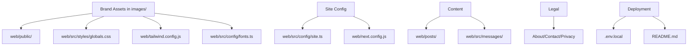

# Branding Customization Plan & Checklist (NFS Big5)

This document provides a comprehensive guide to customizing the NFS Big5 assessment project for your own brand, including actionable steps, file locations, and best practices.

---

## 1. Brandable Assets & Visual Identity

### a. Logos & Icons
- Place your logo and icon assets in the `images/` directory at the project root.
- Replace or update the following files in `web/public/` as needed:
  - `logo.svg`, `logo-512x512.png`
  - `favicon.ico`, `favicon-16x16.png`
  - `apple-touch-icon*.png`
  - All other icon files as needed
- Reference your new assets from `images/` in your code and configuration.

### b. Images
- Update or replace:
  - `front_image.png`
  - `og-image.png`
  - Any other images in `web/public/`
  - Use new branded images from the `images/` directory as appropriate

### c. Avatars & Blog
- Update or add images in:
  - `web/public/avatars/`
  - `web/public/blog/`

---

## 2. Colors, Fonts, and Styles

### a. Global Styles
- Edit `web/src/styles/globals.css` to set your brand’s color palette, fonts, and global CSS rules.

### b. Tailwind/Theme Config
- Update `web/tailwind.config.js` to customize Tailwind’s default colors, fonts, and spacing.

### c. Fonts
- Edit `web/src/config/fonts.ts` to use your brand’s preferred fonts.

---

## 3. Site Metadata & Configuration

### a. Site URL and Email
- In `web/src/config/site.ts`, update:
  - `basePath` to your domain (e.g., `https://yourbrand.com`)
  - `supportEmail` to your support address

### b. Site Name, Description, and Social Links
- Update these in `site.ts` or other config files if present.
- Ensure all references use "NFS Big5" as the assessment name.

### c. Language Support
- Adjust the `languages` array in `site.ts` to add or remove supported languages.

---

## 4. Content & Messaging

### a. Posts and Pages
- Update or add markdown files in `web/posts/` for branded blog posts or informational pages.

### b. Static Text
- Edit files in `web/src/messages/` for custom UI text, error messages, and prompts.

### c. About/Contact/Legal
- Update the About page, contact info, and add your own privacy policy and terms of service.

---

## 5. Deployment & Environment

### a. Environment Variables
- Set your own `DB_URL`, `DB_NAME`, and `DB_COLLECTION` in your deployment environment or `.env.local`.

### b. Next.js Config
- Update `web/next.config.js` for custom domains, redirects, or rewrites.

### c. README & Documentation
- Edit `README.md` to reflect your brand, mission, and support channels.

---

## 6. Optional: White-Labeling & Multi-Brand Support

- Abstract brand assets and config into a separate folder or environment variable for easy switching.
- Use environment variables to load different logos, colors, and metadata per deployment.

---

## Customization Flow Diagram

---

## Branding Customization Checklist

- [ ] Place all logo and icon files in `images/` and update references in the codebase
- [ ] Replace or update images (front, og, avatars, blog) in `web/public/` as needed
- [ ] Edit `globals.css` for NFS Big5 brand colors and styles
- [ ] Update Tailwind config for theme consistency
- [ ] Set custom fonts in `fonts.ts`
- [ ] Change site URL and support email in `site.ts`
- [ ] Update site name, description, and social links to use "NFS Big5"
- [ ] Adjust supported languages as needed
- [ ] Update or add posts/pages in `web/posts/`
- [ ] Edit static text in `web/src/messages/`
- [ ] Update About, Contact, Privacy, and Terms pages
- [ ] Set environment variables for your deployment
- [ ] Update Next.js config for your domain
- [ ] Edit `README.md` for your brand
- [ ] (Optional) Implement white-label/multi-brand support

---

**For further customization, review each section above and update the corresponding files. This plan ensures your deployment is fully branded as NFS Big5 and ready for launch.**